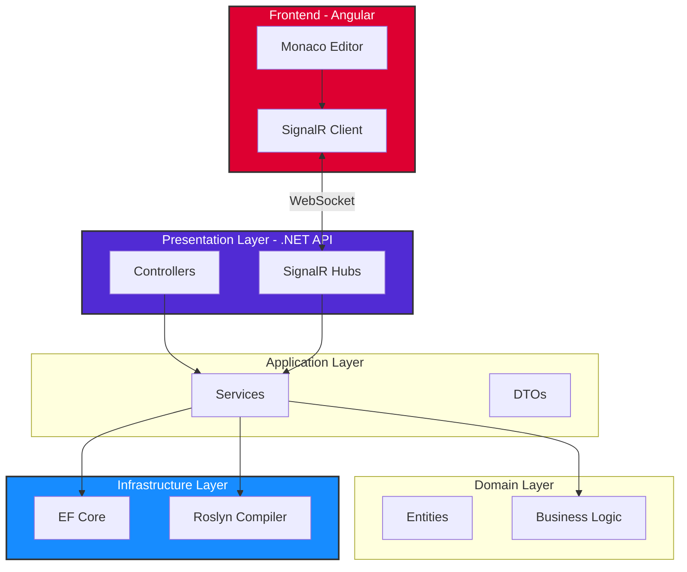

<div align="center">


### Real-time Collaborative Code Editor

**Free • Open Source • Privacy-First**

[Live Demo](https://devcompiler.app) • [Documentation](#documentation) • [Report Bug](https://github.com/patmat511/DevCompiler/issues) • [Request Feature](https://github.com/patmat511/DevCompiler/issues)

[](https://dotnet.microsoft.com/)
[](https://angular.io/)
[](https://www.microsoft.com/sql-server/sql-server-downloads)
[](LICENSE)
[](https://github.com/yourusername/devcompiler/actions)

</div>

---

## 📖 Table of Contents

- [About](#about)
- [Features](#features)
- [Architecture](#architecture)
- [Tech Stack](#tech-stack)
- [Getting Started](#getting-started)
- [Usage](#usage)
- [API Documentation](#api-documentation)
- [Contributing](#contributing)
- [License](#license)

---

## 🎯 About

**DevCompiler** is a free, open-source collaborative code editor designed for technical interviews, pair programming, and live coding sessions. Built with Clean Architecture principles and modern technologies, it provides real-time code synchronization, instant C# compilation, and seamless collaboration.

### Why DevCompiler?

- ✅ **No Sign-Up Required** - Jump straight into coding
- ✅ **100% Free Forever** - No premium tiers, no hidden costs
- ✅ **Privacy-First** - No tracking, no analytics, no data collection
- ✅ **Real-time Collaboration** - See code changes instantly
- ✅ **Built-in Compiler** - Execute C# code directly in browser
- ✅ **Self-Hostable** - MIT licensed, deploy anywhere

---

## ✨ Features

### 🔥 Core Features

| Feature | Description |
|---------|-------------|
| **Real-time Sync** | Multiple users can edit code simultaneously with zero latency |
| **Monaco Editor** | VS Code-powered editor with syntax highlighting and IntelliSense |
| **C# Compilation** | Compile and execute C# code using Roslyn compiler (sandboxed) |
| **Live Chat** | Built-in chat for communication during coding sessions |
| **Room Management** | Create, join, and manage collaborative coding rooms |
| **Share Links** | Simple room sharing via URL - no invitations needed |

### 🔒 Security Features

- **Sandboxed Execution** - Blocked dangerous namespaces (IO, Net, Reflection)
- **Code Length Limits** - Maximum 10,000 characters per submission
- **Execution Timeout** - 5-second timeout for code execution
- **JWT Authentication** - Secure token-based authentication
- **No Persistent Storage** - Code is never permanently stored on servers

---

## 🏗️ Architecture

DevCompiler follows **Clean Architecture** (Onion Architecture) principles for maintainability, testability, and scalability.

---

## 🛠️ Tech Stack

### Backend

| Technology | Purpose | Version |
|------------|---------|---------|
| **.NET** | Backend framework | 8.0 |
| **ASP.NET Core** | Web API | 8.0 |
| **Entity Framework Core** | ORM | 8.0 |
| **SignalR** | Real-time communication | 8.0 |
| **Roslyn** | C# compiler | Latest |
| **PostgreSQL** | Database | 16 |
| **JWT** | Authentication | - |

### Frontend

| Technology | Purpose | Version |
|------------|---------|---------|
| **Angular** | Frontend framework | 18 |
| **TypeScript** | Language | 5.x |
| **Monaco Editor** | Code editor | Latest |
| **RxJS** | Reactive programming | 7.x |
| **SignalR Client** | WebSocket client | Latest |

### DevOps

- **Docker** - Containerization
- **Docker Compose** - Multi-container orchestration
- **GitHub Actions** - CI/CD (optional)

---

## 🚀 Getting Started

### Prerequisites

- [.NET 8 SDK](https://dotnet.microsoft.com/download/dotnet/8.0)
- [Node.js 18+](https://nodejs.org/)
- [Microsoft SQL Server 2022](https://www.microsoft.com/sql-server/sql-server-downloads)
 OR [Docker](https://www.docker.com/)

### Installation

#### Option 1: Docker (Recommended)
```bash
# Clone repository
git clone https://github.com/patmat511/DevCompiler.git
cd devcompiler

# Start services
docker-compose up -d

# Frontend will be available at: http://localhost:4200
# Backend API at: http://localhost:5000
```

#### Option 2: Manual Setup

**1. Clone and restore:**
```bash
git clone https://github.com/patmat511/DevCompiler.git
cd devcompiler
dotnet restore
```

**2. Setup MSSQL:**
```bash
docker run -e "ACCEPT_EULA=Y" \
  -e "SA_PASSWORD=testpassword" \
  -p 1433:1433 \
  --name devcompiler-sql \
  -d mcr.microsoft.com/mssql/server:2022-latest
```

**3. Update connection string in `appsettings.json`:**
```json
{
  "ConnectionStrings": {
    "DefaultConnection": "Server=localhost,1433;Database=devcompiler;User Id=sa;Password=testpassword;TrustServerCertificate=True;"
  }
}
```

**4. Run migrations:**
```bash
cd src/DevCompiler.API
dotnet ef database update
```

**5. Start backend:**
```bash
dotnet run
```

**6. Start frontend (new terminal):**
```bash
cd devcompiler.client
npm install
npm start
```

**7. Open browser:**
```
http://localhost:4200
```

---

## 📱 Usage

### Creating a Room

1. Navigate to `http://localhost:4200`
2. Enter your nickname
3. Click "Create New Room"
4. Share the room URL with collaborators

### Joining a Room

1. Open the shared room URL
2. Enter your nickname
3. Start coding!

### Compiling Code

1. Write C# code in the editor
2. Click "Compile & Run"
3. View output in the results panel

### Real-time Collaboration

- All participants see code changes instantly
- Live cursor positions shown
- Built-in chat for communication

---

## 📚 API Documentation

### Authentication

#### POST `/api/auth/join`

Generate JWT token with nickname.

**Request:**
```json
{
  "nickname": "john_dev"
}
```

**Response:**
```json
{
  "token": "eyJhbGciOiJIUzI1NiIsInR5cCI6IkpXVCJ9...",
  "userId": "550e8400-e29b-41d4-a716-446655440000",
  "nickname": "john_dev"
}
```

### Rooms

#### GET `/api/rooms`

Get all active rooms.

**Response:**
```json
[
  {
    "id": "3fa85f64-5717-4562-b3fc-2c963f66afa6",
    "name": "Algorithm Practice",
    "participantCount": 3,
    "createdAt": "2024-12-07T10:30:00Z"
  }
]
```

#### POST `/api/rooms`

Create a new room.

**Request:**
```json
{
  "name": "Interview Session"
}
```

#### GET `/api/rooms/{id}`

Get room details by ID.

### Compiler

#### POST `/api/compiler/compile`

Compile and execute C# code.

**Request:**
```json
{
  "code": "Console.WriteLine(\"Hello World!\");"
}
```

**Response:**
```json
{
  "success": true,
  "output": "Hello World!\n",
  "errors": [],
  "warnings": [],
  "executionTime": "00:00:00.1234567"
}
```

### SignalR Hub

**Endpoint:** `/hub`

**Methods:**
- `JoinRoom(roomId)` - Join a room
- `LeaveRoom(roomId)` - Leave a room
- `SendMessage(roomId, message)` - Send chat message
- `UpdateCode(roomId, code)` - Sync code changes

---

## 🧪 Running Tests
```bash
# Run all tests
dotnet test

# Run with coverage
dotnet test /p:CollectCoverage=true
```

